<a name="top"></a>

# CDSTraining
CDS Training 

- [ Numeric Functions ](#numeric-functions)
- [String Functions](#string-functions)
- [Date Functions](#date-functions)
- [Cast Functions](#cast-functions)
- [Aggregate Functions](#aggregate-functions)
- [Join Union Associations](#join-union-associations)
  - [Join](#join-union-associations)
    - [inner join example](#inner-join-example)
    - [left join example](#left-join-example)
    - [right join example](#right-join-example)
    - [cross join example](#cross-join-example)
  - [Union](#union)
  - [Associations](#associations)
- [Annotations](#annotations)
- [Parameters](#parameters)
- [DEMO CDS Bulma](#Demo-CDS)


## Numeric Functions

- Abs       : mutlak deger  
- Ceil      : yukariya tam sayiya yuvarla  
- Floor     : asagiya tam sayiya yuvarla 
- Div       : yandaki sayiya bolumu 
- Mod       : yanindaki sayi kadar mod alma 
- Division  : yandaki sayiya bolumu ve virgulden sonra kac sayi 
- Round     : yanindaki rakam kadar yuvarlama

<br>
<a href="https://help.sap.com/doc/abapdocu_cp_index_htm/CLOUD/en-US/index.htm?file=abencds_arithmetic_expression_v2.htm">SAP Docu</a>
<br>
<br>


```abap
@AbapCatalog.sqlViewName: 'DEMO_CDS_NUMFUNC'
@AccessControl.authorizationCheck: #NOT_REQUIRED
define view demo_cds_sql_functions_num
  as select from
    demo_expressions
    {
      matnr,
      miktar,


      abs( num1 )               as r_abs,         // Abs mutlak deger  
      ceil( fltp1 )             as r_ceil,        //Ceil yukariya tam sayiya yuvarla  
      floor( dec1 )             as r_floor,       // Floor asagiya tam sayiya yuvarla 
      div( num1, num2 )         as r_div,         // Div yandaki sayiya bolumu 
      mod( num1, num2 )         as r_mod,         // Mod yanindaki sayi kadar mod alma 
      division( dec2, dec3, 3 ) as r_division,    // Division yandaki sayiya bolumu ve virgulden sonra kac sayi 
      round( dec3, 2 )          as r_round        // Round yanindaki rakam kadar yuvarlama


      abs( miktar )            as r_abs, // Abs mutlak deger
      ceil( miktar )           as r_ceil, //Ceil yukariya tam sayiya yuvarla
      floor( miktar )          as r_floor, // Floor asagiya tam sayiya yuvarla
      div( miktar, 5 )         as r_div,      // Div yandaki sayiya bolumu
      mod( miktar, 3 )         as r_mod,      // Mod yanindaki sayi kadar mod alma
      division( miktar, 3, 2 ) as r_division, // Division yandaki sayiya bolumu ve virgulden sonra kac sayi
      round( dec3, 2 )         as r_round // Round yanindaki rakam kadar yuvarlama

      // Ic ice de kullanim mumkun:
      mod( ceil(miktar), 5 )         as r_mod,

      miktar + 2               as add_miktar,
    }
```


```abap
//Division

  division(10,3,4)                 as value1, // [Ans:3.3333]
  div(55,5)                        as value2, // [Ans:11]
  (10.5  / 3.2)                    as value3, // [Ans:3.28125]

// multiplication

  (10  * 3)                        as value4, // [Ans:30]
  (10 *6 * 3)                      as value5, // [Ans:180]
//Modulo

  mod(2,3)                         as value6, // [Ans:2]

// Addition

  (2 + 3)                           as value7, // [Ans:5]
  (2.2 + 3.7)                      as value8, // [Ans:5.9]
// (2 + 3.7) as value8--> is not possible as both are different data types

//subtraction

  (2 -3)                           as value9, // [Ans:-1]
  (21 -1)                          as value10, // [Ans:20]
  (21.5 - 1.7)                     as value11, // [Ans:1.98]

//(21.5 - 1) as value11--> is not possible as both are different data types

//BODMAS

  (2+3-4*3)                        as value12, // [Ans:-7]

  cast( 2+3-4*3 as abap.fltp)/ 2.0 as value13  // [Ans:-3.5]

// As ‘/’ only support fltp data type, we changed to fltp
```


<p align="right"><a href="#top">⬆️ back to top</a></p>


## String Functions

- concat              birlestirme
- concat_with_space   bosluklu birlestirme       
- Substring           parca alma
- Length              uzunluk
- Left                soldan karakter al
- Right               sagdan karakter al
- Ltrim               soldan eslesen karakteri sil (genelde bolsuk)
- Rtrim               sagdan eslesen karakteri sil (genelde bolsuk)

```abap
      concat(col1,col2)                 as concat1,
      concat(col1, ',')                 as concat2,
      concat(concat(col1, ','), col2)   as concat3,
      concat_with_space(col1, col2, 10) as concatwithspace,
      substring(col2,2,2)               as substringcol,
      length(col2)                      as length_col,
      left(col2,2)                      as left_col2,
      right(col2,2)                     as right_col2,
      ltrim(col2, 'F')                  as leftrim_col,
      rtrim(col2, 'D')                  as righttrim_col
```

<p align="right"><a href="#top">⬆️ back to top</a></p>

## Date Functions

- DATS_IS_VALID(date)                      gecerlilik kontrolu
- DATS_DAYS_BETWEEN(date1,date2)           iki tarih arasindaki fark
- DATS_ADD_DAYS(date,days,on_error)        gün ekleme
- DATS_ADD_DAYS(date,days,on_error)        gün cikarma eksi gün ekleme
- DATS_ADD_MONTHS(date,months,on_error)    ay ekleme
- DATS_ADD_MONTHS(date,months,on_error)    ay cikarma eksi ay ekleme

<br>
<a href="https://help.sap.com/doc/abapdocu_cp_index_htm/CLOUD/en-US/index.htm?file=abenddic_date_time_functions.htm">SAP Docu</a>
<br>
<br>

```abap
  key col2                                                      as Col2,
      datecol                                                   as Datecol,

      dats_is_valid(datecol)                                    as disvalid1, // return 1
      dats_is_valid(cast('20230101' as abap.dats))              as disvalid2, // return 1
      dats_is_valid(cast('01012023' as abap.dats))              as disvalid3, // return 0
      dats_is_valid(cast('12345678' as abap.dats))              as disvalid4, // return 0

      dats_days_between(datecol, cast('20230101' as abap.dats)) as ddbtw,
      dats_add_days(datecol, 10, 'NULL')                        as ongunEkli,
      dats_add_days(datecol, -10, 'NULL')                       as ongunCik,
      dats_add_months(datecol, 3, 'NULL')                       as ucAyEkli,
      dats_add_months(datecol, -3, 'NULL')                      as ucAyCik
```

<p align="right"><a href="#top">⬆️ back to top</a></p>

## Cast Functions

```abap
      cast( col3 as abap.char( 10 ))  as col3Char,
      cast( col3 as abap.dec( 8, 1 )) as col3dec,
      '17091983'                      as colTest1,
      cast('17091983' as abap.dats)   as colTest2
```

<p align="right"><a href="#top">⬆️ back to top</a></p>

## Aggregate Functions

- Goub by yapmadan calismiyor ve mümkünse sadece kullanacagimiz fieldleri secmeliyiz
- Max                   O grubun en buyuk degerini alir
- Min                   O grubun en kucuk degerini alir
- Sum                   O grubun degerlerini toplar
- Avg                   O grubun degerlerinin ortalamasini alir
- Count                 kac satiri var
- Count( Distinct )     tekrar etmeyen kac satiri var


```abap
{
  key vbeln                  as Vbeln,
      //key posnr as Posnr,
      //kwmeng as Kwmeng,
      max(kwmeng)            as kwmeng_max,
      min(kwmeng)            as kwmeng_min,
      sum(kwmeng)            as kwmeng_sum,
      avg(kwmeng)            as kwmeng_avg,
      count(*)               as kwmeng_count1,
      count(distinct kwmeng) as kwmeng_count2
}


group by
  vbeln
```
<p align="right"><a href="#top">⬆️ back to top</a></p>

## Join Union Associations

### Join

- Inner join   : Belirli bir field iki tablolda da olmak zorundadir. Bu Fielde gore eslesen verileri birlestirerek dondurur.
- Left join    : Bir tablonun alanlari diger tablonun alanlarina ekler, ortak field yoksa eklenen tablonun fieldlerindeki degerler null olarak gelir.
- Right join   : Bir tablonun alanlari diger tablonun alanlarina ekler, ortak field yoksa eklenen tablonun fieldlerindeki degerler null olarak gelir.
- Cross join   : iki tabloyu tüm kombinasyonlarıyla birleştirmek için kullanılan bir birleştirme türüdür. CROSS JOIN, her satırın ilk tabloyla her satırın ikinci tabloyu birleştirdiği bir çapraz ürün (cross product) oluşturur. Sonuç, bir tablonun her satırını diğer tablonun her satırıyla eşleştirir. Cross join, genellikle büyük veri setleri üzerinde çalışırken dikkatli kullanılmalıdır, çünkü her iki tablonun tüm kombinasyonlarını oluşturur ve sonuç çok büyük olabilir.

#### Inner Join Example

```abap
@AbapCatalog.sqlViewName: 'ZINNERJOINEXAMPLE'
@AbapCatalog.compiler.compareFilter: true
@AccessControl.authorizationCheck: #CHECK
@EndUserText.label: 'Inner Join Example'

define view Z_InnerJoinExample as
  select from scarr as airline
    inner join spfli as flight
    on airline.carrid = flight.carrid
{
  airline.carrid,
  airline.carrname,
  flight.connid,
  flight.cityfrom,
  flight.cityto
};
```

<details>
  <summary>Detay Bilgi</summary>
  <br>
    INNER JOIN, iki tabloyu belirli bir koşula göre birleştirmek için kullanılır. Bu koşul, eşleşen kayıtları bulmak için kullanılır. İki tablonun birleştirildiği yerde yalnızca eşleşen verilere sahip satırlar döndürülür.
  <br>
    Tablo 1
  <br>
  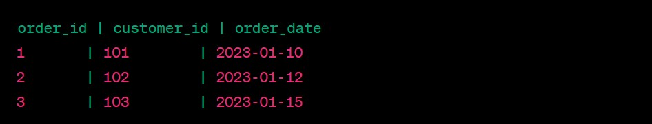
  <br>
    Tablo2
  <br>
    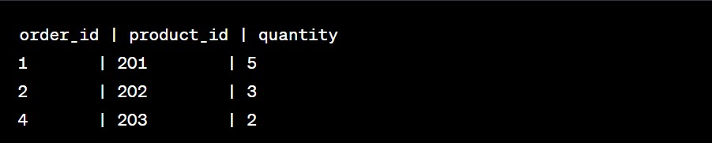
  <br>
  
```sql
SELECT orders.order_id, customer_id, order_date, product_id, quantity
 FROM orders 
INNER JOIN order_details ON orders.order_id = order_details.order_id;
```
  <br>
    Sonuc
  <br>  
    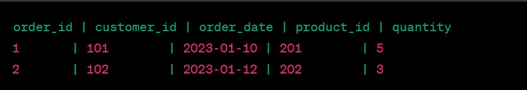

</details>

#### Left Join Example
```abap
@AbapCatalog.sqlViewName: 'ZLEFTJOINEXAMPLE'
@AbapCatalog.compiler.compareFilter: true
@AccessControl.authorizationCheck: #CHECK
@EndUserText.label: 'Left Join Example'

define view Z_LeftJoinExample as
  select from scarr as airline
    left outer join spfli as flight
    on airline.carrid = flight.carrid
{
  airline.carrid,
  airline.carrname,
  flight.connid,
  flight.cityfrom,
  flight.cityto
};

```

<details>
  <summary>Detay Bilgi</summary>
  <br>
    LEFT JOIN, soldaki (ilk) tablodaki tüm satırları ve eşleşen sağdaki (ikinci) tablodan gelen satırları içeren sonuçlar üretir. Eşleşme olmadığında, sağ tablo alanları NULL olarak doldurulur. 
  <br>
    Tablo 1 (students):
  <br>
  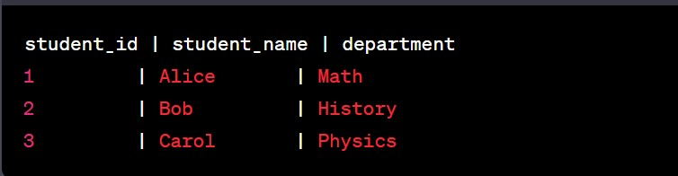
  <br>
    Tablo 2 (grades)
  <br>
    
  <br>
  <br>
  
```sql
SELECT students.student_id, student_name, department, course, grade
FROM students
LEFT JOIN grades ON students.student_id = grades.student_id;

```
  <br>
    Sonuc
  <br>  
    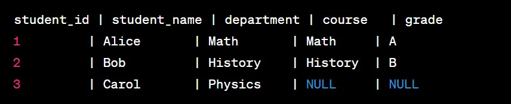

</details>

#### Right Join Example

```abap
@AbapCatalog.sqlViewName: 'ZRIGHTJOINEXAMPLE'
@AbapCatalog.compiler.compareFilter: true
@AccessControl.authorizationCheck: #CHECK
@EndUserText.label: 'Right Join Example'

define view Z_RightJoinExample as
  select from scarr as airline
    right outer join spfli as flight
    on airline.carrid = flight.carrid
{
  airline.carrid,
  airline.carrname,
  flight.connid,
  flight.cityfrom,
  flight.cityto
};

```

<details>
  <summary>Detay Bilgi</summary>
  <br>
    RIGHT JOIN, RIGHT JOIN ile birleştirilen tablonun tüm satırlarını ve eşleşen sol tablodan gelen satırları içerir. Eşleşme olmadığında, sol tablo alanları NULL olarak doldurulur. RIGHT JOIN, LEFT JOIN'ın sağa çevrilmiş halidir.
  <br>
    Tablo 1 (authors)
  <br>
  
  <br>
    Tablo 2 (books)
  <br>
    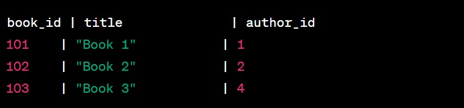
  <br>
  <br>
  
```sql
SELECT authors.author_id, author_name, title
FROM authors
RIGHT JOIN books ON authors.author_id = books.author_id;


```
  <br>
    Sonuc
  <br>  
    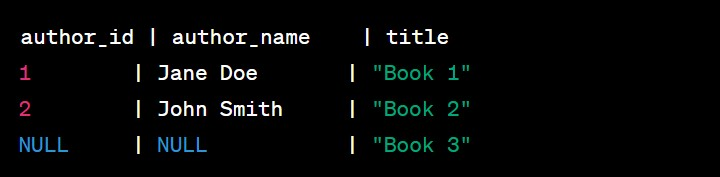

</details>

#### Cross Join Example

```abap
@AbapCatalog.sqlViewName: 'ZCROSSJOINEXAMPLE'
@AbapCatalog.compiler.compareFilter: true
@AccessControl.authorizationCheck: #CHECK
@EndUserText.label: 'Cross Join Example'

define view Z_CrossJoinExample as
  select from scarr as airline, spfli as flight
{
  airline.carrid,
  airline.carrname,
  flight.connid,
  flight.cityfrom,
  flight.cityto
};

```

<details>
  <summary>Detay Bilgi</summary>
  <br>
    Cross join (çapraz birleştirme), SQL'de iki tabloyu tüm kombinasyonlarıyla birleştirmek için kullanılan bir birleştirme türüdür. CROSS JOIN, her satırın ilk tabloyla her satırın ikinci tabloyu birleştirdiği bir çapraz ürün (cross product) oluşturur. Sonuç, bir tablonun her satırını diğer tablonun her satırıyla eşleştirir. Cross join, genellikle büyük veri setleri üzerinde çalışırken dikkatli kullanılmalıdır, çünkü her iki tablonun tüm kombinasyonlarını oluşturur ve sonuç çok büyük olabilir.
  <br>
    Tablo 1 (employees)
  <br>
  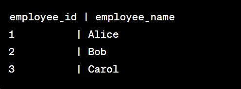
  <br>
    Tablo 1 (departments)
  <br>
    
  <br>
  <br>
  
```sql
SELECT employee_name, department_name
FROM employees
CROSS JOIN departments;

```
  <br>
    Sonuc
  <br>  
    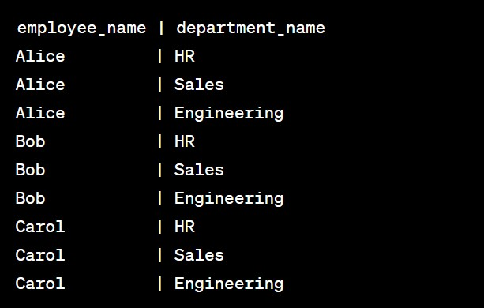

</details>

<p align="right"><a href="#top">⬆️ back to top</a></p>

### Union

Union, join in dikey olan seklidir diyebiliriz. Yani Tablolari alt alta eklemek icin kullanilir. Field isimlerinin ve sayisinin ortusmesi gerekir.

```abap
@AbapCatalog.sqlViewName: 'ZUNIONEXAMPLE'
@AbapCatalog.compiler.compareFilter: true
@AccessControl.authorizationCheck: #CHECK
@EndUserText.label: 'Cross Join Example'

define view Z_unionExample as
  select from z_table1_name
{
  col1
}
where col1 > 10
union all select from z_table2_name    //Unique verileri cekmek icin 'All' ifadesi kaldirilir. 
{
  col1
}
where col1 < 10
union all select from z_table3_name
{
  col1
}

```

<details>
  <summary>Detay Bilgi</summary>
  <br>

  UNION, iki veya daha fazla SELECT sorgusunun sonuçlarını birleştirmek için kullanılır. Bu operatör, sonuç kümelerini yinelerken tekrarlanan satırları kaldırarak tek bir sonuç kümesi oluşturur. İşte UNION operatörü hakkında kısa bilgiler:

  - UNION operatörü, birleştirilen SELECT sorgularının sonuç kümesini sıralı ve benzersiz bir sonuç kümesine dönüştürür. Yani aynı satırlar yalnızca bir kez görünür.
  - UNION operatörü, iki veya daha fazla SELECT sorgusu arasında kullanılabilir. Bu sorguların sütun sayıları ve sıralama düzenleri uygun olmalıdır.
  - UNION operatörü, sorguların sonuçlarını birleştirirken sütun adları veya sütun türleriyle ilgilenmez. Sadece sıra sayısı ve sıra düzeni önemlidir.

    
  <br>
    Union Ornekleri
  <br>
  <br>
  
```abap
@AbapCatalog.sqlViewName: 'DEMOCDSUNIONTYPE'
@AccessControl.authorizationCheck: #NOT_REQUIRED
define view Demo_Cds_Union_Element_Type(
    id,
    col1,
    col2
  )
  as select from
    demo_expressions
    {
      id,
      num1                      as col1,
      cast( num1 as abap.int8 ) as col2
    }
union all select from
  demo_expressions
    {
      id,
      numlong1 as col1,
      numlong1 as col2
    }

```
  <br>

  ```abap
@AbapCatalog.sqlViewName: '...'
define view ... ( c1, c2, c3, c4 ) as
  select
    from demo_join1
      { a, b, c, d }
    union
      select
        from demo_join2
          { d, e, f, g }

```

  <br>

  ```abap
@AbapCatalog.sqlViewName: '...'
define view ... as
  select
    from demo_join1
      { a as c1, b as c2, c as c3, d as c4 }
    union
      select
        from demo_join2
          { d as c1, e as c2, f as c3, g as c4 }

```

<br>
    Union SFlight Ornegi
  <br>
  <br>
  
```abap
@AbapCatalog.viewEnhancementCategory: [#NONE]
@AccessControl.authorizationCheck: #NOT_REQUIRED
@EndUserText.label: 'Union Example'
@Metadata.ignorePropagatedAnnotations: true
@ObjectModel.usageType:{
    serviceQuality: #X,
    sizeCategory: #S,
    dataClass: #MIXED
}
define view entity zjp_cds_union
  as select from /dmo/flight
{
  key carrier_id     as CarrierId,
  key connection_id  as ConnectionId,
  key flight_date    as FlightDate,
      @Semantics.amount.currencyCode: 'CurrencyCode'
      price          as Price,
      currency_code  as CurrencyCode,
      plane_type_id  as PlaneTypeId,
      seats_max      as SeatsMax,
      seats_occupied as SeatsOccupied
}
where
  currency_code = 'USD'

union all

select from /dmo/flight
{
  key carrier_id     as CarrierId,
  key connection_id  as ConnectionId,
  key flight_date    as FlightDate,
      price          as Price,
      currency_code  as CurrencyCode,
      plane_type_id  as PlaneTypeId,
      seats_max      as SeatsMax,
      seats_occupied as SeatsOccupied
}
where
  currency_code = 'EUR'

```
  <br>
  <br>
    Sonuc
  <br>  
    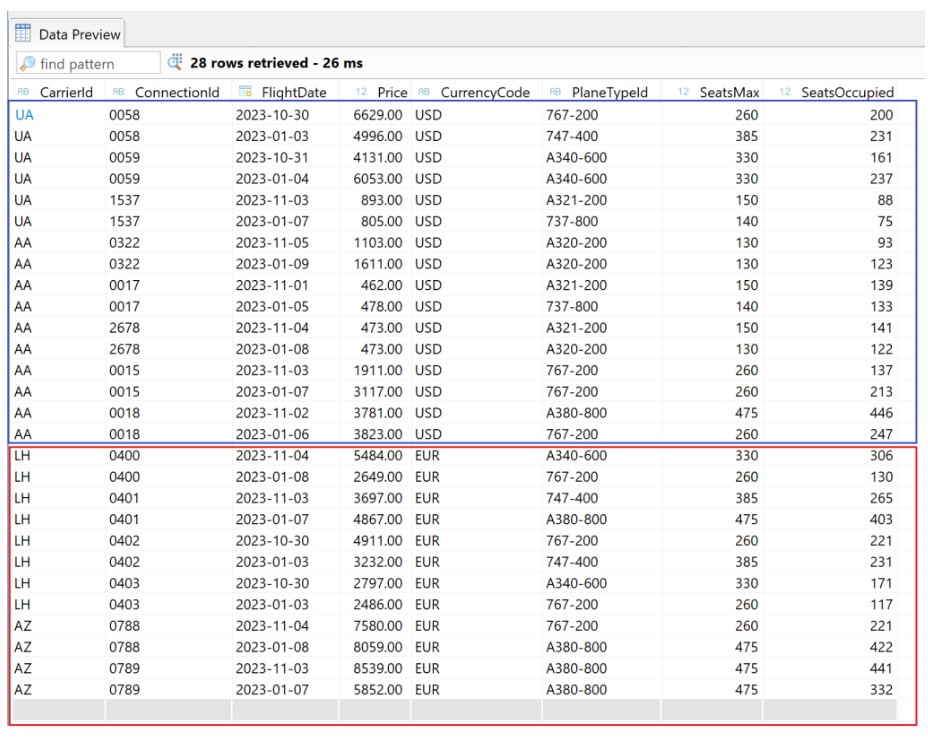
  


</details>

<p align="right"><a href="#top">⬆️ back to top</a></p>

### Associations

Associations, bir Database Table veya başka bir CDS View gibi objeler arasındaki ilişkileri tanımlar. Tipik anlamda Left Outer Join gibi calisir. Associations icin Join-On-Demand ifadesi de kullanilir. CDS view in çıktısı yalnızca SOL tablodaki verileri gösterir. İlgili tablodaki veriler yalnızca talep üzerine gösterilir. 
  <br>
  <br>
<a href="https://help.sap.com/doc/abapdocu_cp_index_htm/CLOUD/en-US/index.htm?file=abencds_association_v2.htm">SAP Docu</a>
<br>
<br>

Bir Associations örnegi incelersek ;


```abap
@AbapCatalog.sqlViewName: 'ZFRT_ASSOC_1' 
@AccessControl.authorizationCheck: #NOT_REQUIRED 
@EndUserText.label: 'Simple Association' 
define view zfrt_cds_association_1 as select from scarr 
association [1..*] to spfli as _spfli 
    on $projection.carrid = _spfli.carrid { 
    key scarr.carrid as carrid, 
    scarr.carrname as Carrname, 
    scarr.currcode as Currcode, 
    _spfli                        //Exposed association 
} 
```


Kodu incelersek;
   - Soldaki tablo SCARR'dır – buna Primary Table diyeceğiz
   - Sağdaki tablo SPFLI'dir – buna Associated Table diyeceğiz
   - Join yerine kardinaliteyle (cardinality) ilişkilendirme [1..*] kullanılır.
   - Associated table a _ (alt çizgi) ile başlayan takma ad verilir. Bu zorunlu değildir, yalnızca bir adlandırma kuralıdır.
   - ON condition, primary table scarr dan gelen Projection listteki bir alanı kullanır.
   - Sonunda association yani _spfli ortaya çıkar.
   - Key seçilmesi zorunludur (mandatory); anahtar seçilmezse, association çağrıldığında associated table daki tüm girişler döndürülür.
   - CDS görünümünün çıktısı yalnızca SOL tablodaki verileri gösterir. İlgili tablodaki veriler yalnızca talep üzerine gösterilir.


  <br>  
    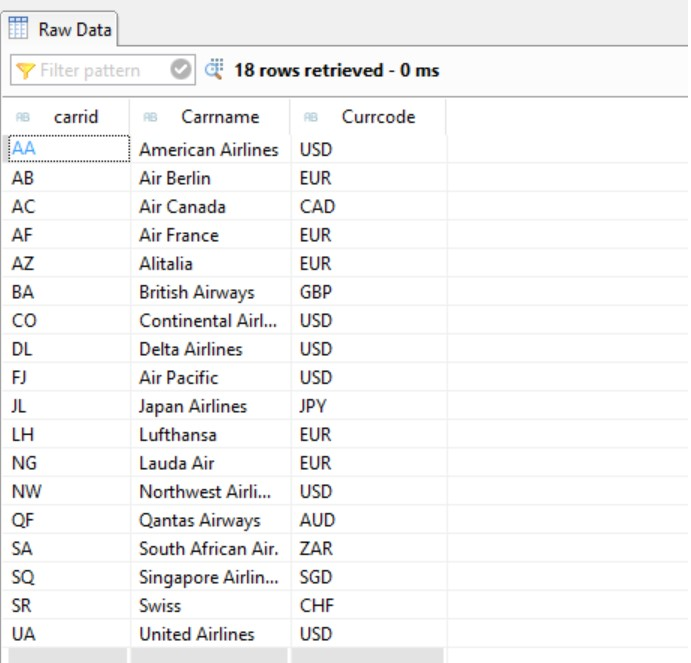
  <br>  
    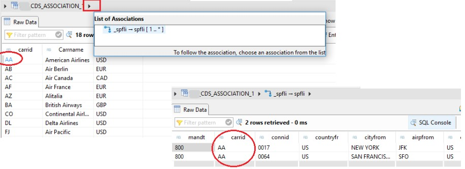
  <br>  
  <br>  

  CDS View in Abap kodunda kullanimi;


```abap
"Select Queries on Association view
"Without association fields 
    SELECT carrid, carrname 
       FROM zjp_cds_association_1 
       INTO TABLE @DATA(carriers). 
    IF sy-subrc EQ 0. 
      cl_demo_output=>display( carriers ). 
    ENDIF.

"With association fields
    SELECT
       FROM zjp_cds_association_1\_spfli as flight
       FIELDS flight~carrid, flight~connid
       INTO TABLE @DATA(flights).
    IF sy-subrc EQ 0.
      cl_demo_output=>display( flights ).
    ENDIF.
```

Multiple Associations örnegi;

```abap
@AbapCatalog.sqlViewName: 'ZFRT_ASSOC_1' 
@AccessControl.authorizationCheck: #NOT_REQUIRED 
@EndUserText.label: 'Simple Association' 
define view zfrt_cds_association_1 as select from scarr 
association [1..*] to spfli as _spfli 
    on $projection.carrid = _spfli.carrid 
    association [1..*] to sflight as _sflight 
    on $projection.carrid = _sflight.carrid 
{ 
    key scarr.carrid as carrid, 
    scarr.carrname as Carrname, 
    scarr.currcode as Currcode, 
    _spfli,                        //Exposed association 
    _sflight                       //Exposed association 
}
```
<p align="right"><a href="#top">⬆️ back to top</a></p>

# Annotations

CDS kullanırken, verilere ilişkin ek bilgileri saklamak ve işlemek için "annotations" denilen özel işaretleme özelliklerini kullanabilirsiniz. Annotations, CDS tanımlarına ek bilgi eklemenizi sağlayan işaretleme özellikleridir. Bu bilgiler, verilere ilişkin açıklamaları, işleme kurallarını, düzenlemeleri ve hatta UI ekranlarının görünümünü tanımlamak için kullanılabilir. Annotations, veri modelinizi ve iş mantığınızı açıklığa kavuşturabilir ve diğer geliştiricilerin projenizi daha iyi anlamasına yardımcı olabilir.

<br>
800 den fazla annotation bulunuyor. Bazilari asagida aciklanmistir. Detayli bilgi icin ;
<br>
<a href="https://help.sap.com/doc/abapdocu_756_index_htm/7.56/en-US/abencds_annotations_frmwrk_tables.htm">SAP documentation</a>

<br>

<b>@AbapCatalog.sqlViewName:</b> SQL görünüm adını tanımlar. Bu annotation, CDS görünümünün altındaki SQL tablosunun adını belirler.
<br>
<b>@AbapCatalog.compiler.compareFilter:</b> Derleme sırasında karşılaştırma filtresini etkinleştirir veya devre dışı bırakır. Etkinleştirilirse, veriler daha fazla kontrol edilir ve hata tespit edilebilir.
<br>
<b>@AccessControl.authorizationCheck:</b> Erişim kontrolünün etkinleştirilip etkinleştirilmeyeceğini belirler. Bu, kullanıcıların CDS görünümüne erişimini kontrol edebilir.
<br>
<b>@EndUserText.label:</b> CDS görünümünün kullanıcı dostu adını belirler. Bu, CDS görünümünün açıklamasını temsil eder.
<br>
<b>@EndUserText.description:</b> CDS görünümünün açıklamasını detaylandırır. Kullanıcıların CDS görünümünü daha iyi anlamalarına yardımcı olabilir.

```abap
@AbapCatalog.sqlViewName: 'ZEXAMPLE'
@AbapCatalog.compiler.compareFilter: true
@AccessControl.authorizationCheck: #CHECK
@EndUserText.label: 'Example CDS View'
@EndUserText.description: 'This is an example CDS view with annotations.'

define view Z_Example as
  select from scarr as airline
  {
    key airline.carrid as CarrierID,
    airline.carrname as CarrierName
  };


```

<b>@ObjectModel.readOnly:</b> Bir sütunun sadece okunabilir (readOnly) olduğunu belirten bir annotation. Bu sütun, yazma işlemlerine izin vermez.
<br>
<b>@Search.searchable:</b> Bir sütunun aranabilir (searchable) olduğunu belirten bir annotation. Bu, sütunu arama sorguları için kullanılabilir kılar.
<br>

```abap
@ObjectModel.readOnly: true
@Search.searchable: true
entity ExampleEntity {
  key id: UUID;
  name: String(50);
}


```

<b>@ObjectModel.association.type:</b> İki varlık (entity) arasındaki ilişkinin türünü belirleyen bir annotation. Örneğin, "COMPOSITION" veya "AGGREGATION" gibi ilişki türleri kullanılabilir.


```abap
@ObjectModel.association.type: #COMPOSITION
entity ParentEntity {
  key id: UUID;
  children: association [0..*] to ChildEntity on id = parent_id;
}

entity ChildEntity {
  key id: UUID;
  parent_id: UUID;
}

```


<b>@Semantics.currencyCode:</b> Para birimi sütunu için kullanılan bir annotation. Bu annotation, bir para birimi sütununun hangi para birimini temsil ettiğini belirtir.


```abap
@Semantics.currencyCode: 'Currency'
entity SalesData {
  key id: UUID;
  amount: Decimal(16, 2);
  currency: CurrencyCode;
}

```

<b>@Semantics.quantity:</b> Miktar sütunu için kullanılan bir annotation. Bu, miktar sütununun bir niceliği temsil ettiğini belirtir.


```abap
@Semantics.quantity.unitOfMeasure: 'QuantityUnit'
entity Stock {
  key id: UUID;
  quantity: Decimal(16, 2);
  quantityUnit: UnitOfMeasure;
}

```

<p align="right"><a href="#top">⬆️ back to top</a></p>

# Parameters


```abap
@AbapCatalog.sqlViewName: 'YFA_CDS_EX3'
@AbapCatalog.compiler.compareFilter: true
@AbapCatalog.preserveKey: false
@AccessControl.authorizationCheck: #NOT_REQUIRED
@EndUserText.label: 'Demo Association'
define view yfa_ddl_ex3
    with parameters parameter_name : meins
 as select from mara
{
    matnr,
    matkl,
    mtart

}
where meins = $parameters.parameter_name
```

Parametreli CDS'in ABAP tarafinda kullanilmasi;

```abap

SELECT * FROM yfa_ddl_ex3       ( parameter_name = LE )
 INTO TABLE @DATA(lt_table).
IF sy-subrc EQ 0.
    cl_demo_output=>display( lt_table ).
ENDIF.
```
# #Demo-CDS

SAP'in olusturdugu DEMO CDS'lere erismek icin "ctrl + shift + a" ile Abap Development Object arama sayfasi acilir ve "*demo* type:ddls" yazilir.


    

<p align="right"><a href="#top">⬆️ back to top</a></p>
